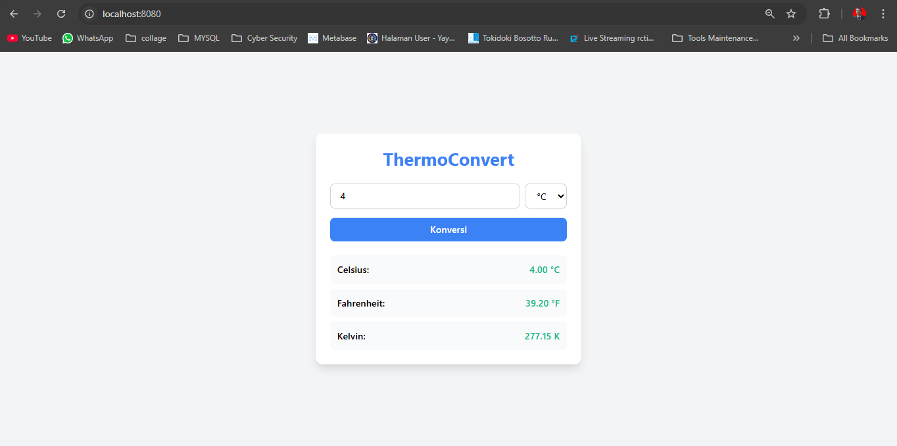
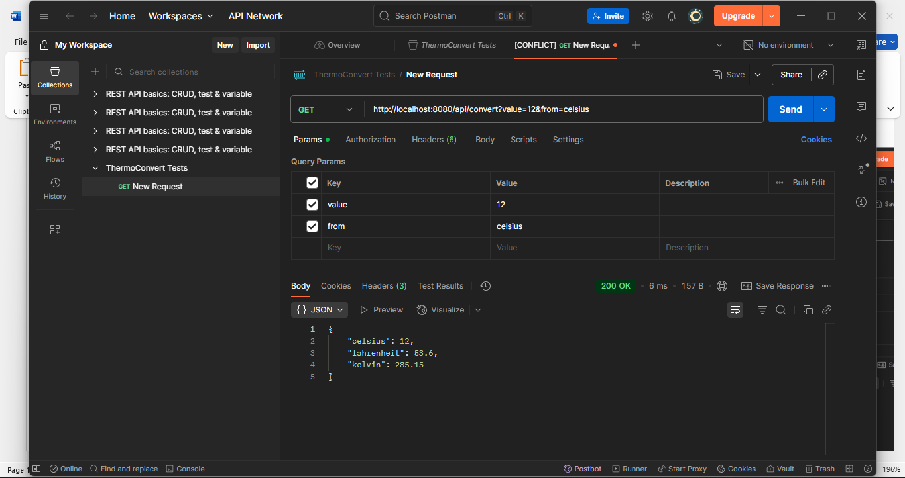

# ThermoConvert 🔥❄️

Aplikasi konversi suhu berbasis web dengan API menggunakan Golang



## API Endpoint


## Laporan Proyek
[Laporan UAS - Stevanus Andika Galih Setiawan](assets/LAPORAN UAS_STEVANUS ANDIKA GALIH SETIAWAN_202303110008_RK231.pdf)

## Fitur Utama
- Konversi real-time antara Celsius, Fahrenheit, dan Kelvin
- Antarmuka web responsif
- REST API endpoint (`/api/convert`)
- Error handling yang jelas

## Teknologi
- **Backend**: Golang 1.21+
- **Router**: Gorilla Mux
- **Frontend**: HTML5, Tailwind CSS, Vanilla JS
- **API Format**: JSON

## Cara Menjalankan
```bash
# Clone repositori
git clone https://github.com/StevanusAndika/thermoconvert.git
cd thermoconvert

# Jalankan aplikasi
go run main.go

# Akses di browser
http://localhost:8080